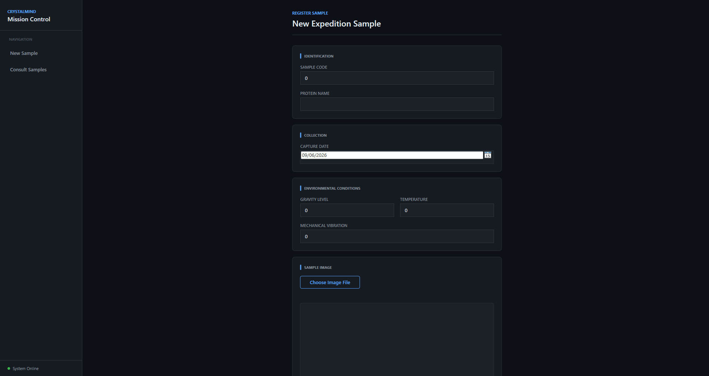
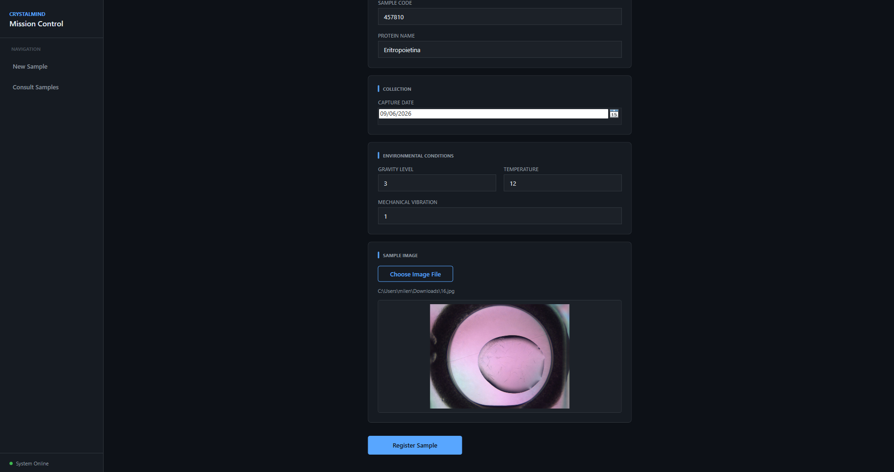
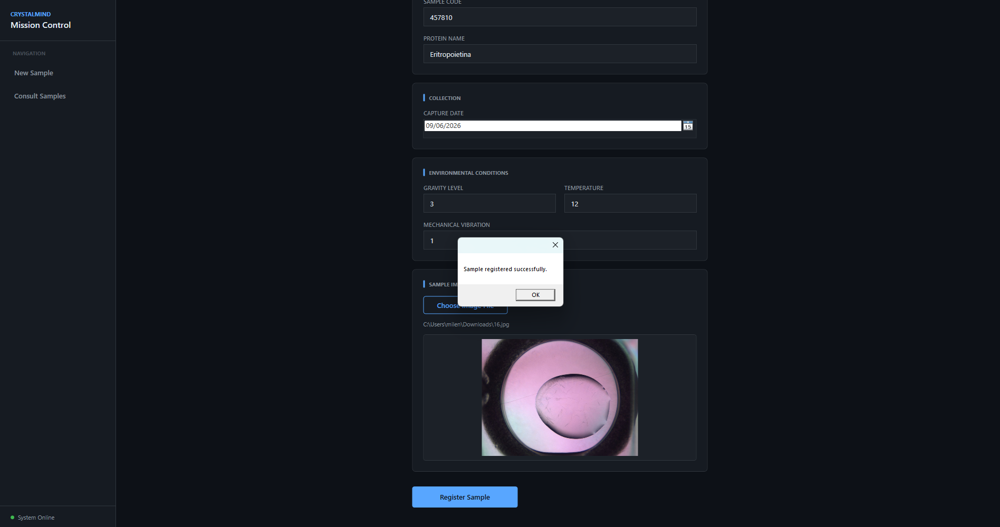
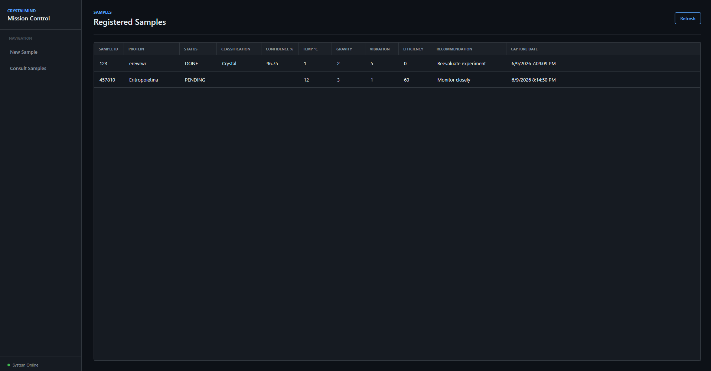

#  FastCrystal Desktop Client

> Aplicação desktop desenvolvida em **C#**, **WPF** e **MVVM** para registro, monitoramento e gerenciamento de amostras de cristais de proteínas obtidas em experimentos simulados de medicina espacial.

---

#  Motivação do Projeto

O desenvolvimento de novos medicamentos é um processo extremamente caro e demorado.

Uma das áreas mais promissoras da pesquisa farmacêutica moderna é o crescimento de **cristais de proteínas em ambientes de microgravidade**, como a Estação Espacial Internacional (ISS).

Nessas condições, os cristais podem crescer de forma mais organizada e com menos imperfeições, permitindo uma análise estrutural mais precisa e acelerando o desenvolvimento de medicamentos para diversas doenças.

Entretanto, experimentos espaciais apresentam desafios importantes:

- Alto custo de lançamento de cargas ao espaço;
- Quantidade limitada de experimentos por missão;
- Longos períodos de incubação;
- Necessidade de monitoramento constante;
- Grande impacto financeiro quando uma amostra é perdida ou inutilizada.

Diante desse cenário, o projeto **FastCrystal** propõe uma solução integrada para monitoramento e análise de experimentos de cristalização de proteínas em ambiente espacial.

O sistema permite registrar amostras, armazenar imagens, acompanhar condições ambientais e aplicar Inteligência Artificial para auxiliar pesquisadores na identificação de amostras promissoras.

---

#  Objetivos

O projeto tem como objetivo:

- Simular o monitoramento de experimentos espaciais.
- Registrar imagens de cristais de proteínas.
- Coletar variáveis ambientais importantes.
- Integrar diferentes tecnologias e disciplinas da Engenharia de Software.
- Aplicar Inteligência Artificial para classificação de amostras.
- Reduzir desperdícios em missões espaciais.
- Auxiliar na tomada de decisão dos pesquisadores.

---

#  Arquitetura da Solução

```text
┌───────────────────────┐
│     Aplicação WPF     │
│      (C# / MVVM)      │
└───────────┬───────────┘
            │
            │ HTTP
            ▼
┌───────────────────────┐
│       API SOA         │
│ Spring Boot (Java)    │
└───────────┬───────────┘
            │
            │ Requisição
            ▼
┌───────────────────────┐
│ FastAPI + IA (Python) │
│ Classificação Visual  │
└───────────┬───────────┘
            │
            ▼
┌───────────────────────┐
│      Banco MySQL      │
└───────────────────────┘
```

---

#  Fluxo Geral do Sistema

## Fluxo de Cadastro

```text
Usuário
   │
   ▼
Seleciona imagem
   │
   ▼
Preenche dados da amostra
   │
   ▼
Aplicação WPF
   │
   ▼
API SOA (Spring Boot)
   │
   ├── Salva imagem localmente
   │
   ├── Salva dados no banco
   │
   └── Chama serviço de IA
                │
                ▼
         FastAPI (Python)
                │
                ▼
       Classificação da amostra
                │
                ▼
         Salva resultado
```

---

#  Evidências de Execução

## Cadastro de Amostra


---

## Upload de Imagem



---

## Cadastro Realizado com Sucesso



---

## Consulta de Amostras



---

#  Componentes do Projeto

## Aplicação Desktop (C#)

Responsável por:

- Cadastro de amostras;
- Upload de imagens;
- Consulta de registros;
- Consumo da API REST;
- Exibição dos resultados.

### Tecnologias

- C#
- .NET 8
- WPF
- MVVM
- HttpClient

---

## API SOA (Java)

Responsável por:

- Receber requisições do cliente;
- Validar dados;
- Armazenar imagens;
- Persistir informações;
- Integrar com a IA.

### Tecnologias

- Java
- Spring Boot
- Spring Data JPA
- MySQL

---

## Inteligência Artificial

Responsável por:

- Receber imagens da API;
- Processar a imagem;
- Classificar a amostra.

### Classes previstas

- Crystal
- Clear
- Precipitate
- Other

### Tecnologias

- Python
- FastAPI
- OpenCV
- TensorFlow / Scikit-Learn

---

## Aplicação Mobile

Responsável por:

- Consultar experimentos;
- Exibir classificação;
- Exibir métricas da missão;
- Visualizar imagens registradas.

### Tecnologias

- React Native

---

#  Estrutura do Banco de Dados

## Samples

Armazena informações da amostra.

Campos principais:

- sample_id
- protein_name
- capture_date
- gravity_level
- temperature
- mechanical_vibration
- image_path
- status

---

## Predictions

Armazena classificações produzidas pela IA.

Campos principais:

- sample_id
- classification
- confidence
- prediction_date

---

#  Passo a Passo de Utilização

### 1. Iniciar a [Api SOA](https://github.com/ViniciusVilasB/FastCrystalAPI)

### 2. Iniciar a Aplicação Desktop

### 3. Registrar uma Nova Amostra

Informar:

- Sample ID
- Nome da Proteína
- Data de Captura
- Gravidade
- Temperatura
- Vibração Mecânica

---

### 4. Fazer upload de uma Imagem

Escolha um arquivo:

```text
.jpg
.jpeg
.png
```

---

### 5. Salvar

### 6. Processamento

O sistema irá:

1. Enviar os dados para a API;
2. Salvar a imagem;
3. Registrar no banco;
4. Solicitar classificação para a IA;
5. Armazenar o resultado.

---

### 7. Consultar Amostras

Acesse:

```text
Visualizar Amostras
```

Será exibido:

- ID da Amostra
- Proteína
- Status
- Classificação
- Confiança
- Temperatura
- Gravidade
- Vibração
- Eficiência
- Recomendação

---

##  Integrantes

| Disciplina | Aplicação |
|------------|------------|
|Gabriel Luni Nakashima | RM558096|
|Gustavo Henrique | RM556712|
|Milena Garcia | RM555111|
|Renan Simões Gonçalves|  RM555584|
|Vinícius Vilas Boas | RM557843|
